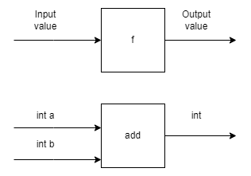

# 1. Einführung 20.02.2026

## Programmierparadigma

- Deklarative beschreibt das **WAS**
- Imperativ beschreibt das **WIE**

---
 
## Prozedurale Programmierung

### Definition
- Anweisung für Anweisung wird ausgeführt
- Imperatives Paradigma

---

## Funktionale Programmierung

### Vorteile
- Keine Seiteneffekte
- Einfacher zu lesen, zu testen und zu debuggen
- Besser geeignet für parallele Prozesse
### Nachteile
- Performance
- Neue Denkweise -> etwas Gewöhnungsbedürftig

---

## Pure vs Impure

```scala
def add(a: Int, b: Int): int = a + b

// Impure, depends on external variable
var counter = 0
def impureAdd(a: Int, b: Int): Int = {
	counter += 1 // side effect!
	a + b + counter // different result each time
}
```

---

# 01_Einführung

## Begriff Funktion

```java
public static int add(int a, int b) {
	return a + b;
}
```
_Diese Funktion erhält _zwei Zahlen als Parameter_, addiert diese und retourniert _die Summe beider Zahlen_._


```java
public static char getFirstCharacter(String s) {
	return s.charAt(0);
}
```
_Diese Funktion erhält _einen String als Parameter_ und retourniert _das erste Zeichen aus dem String_._

Beide Beispiele haben etwas gemeinsam: Sie erhalten Werte als Input, machen etwas damit und geben ein Resultat zurück. **Das ist die Eigenschaft einer Funktion**.



Ganz wichtig ist, dass die Funktionen stets _einen Wert retournieren_. Das ist eine wichtige Eigenschaft von Funktionen. Wenn wir Funktionen mit einer korrekten Signatur schreiben, dann müssen wir uns als Programmierer nicht um den Inhalt in der Box kümmern. Wir können die Funktion aufrufen (die z.Bsp ein anderer Programmierer geschrieben hat) und wissen, dass wir einen Wert zurückerhalten.

---

## Imperative vs Deklarativ Programmieren

Wenn wir imperativ programmieren, dann geben wir die einzelnen Schritte im Programm vor. Wir beschreiben somit das WIE. Beispiel: Wir wollen ein Programm schreiben, welches uns eine Punktzahl aus einem Wort ermittelt. Wenn wir imperativ programmieren, würde das so aussehen:

```java
public static int calculateScore(String word){
	int score = 0;
	for (char c : word.toCharArray()) {
		score++;
	}
	return score;
}
```

Ganz anders, wenn wir deklarativ programmieren. Uns interessiert nicht das WIE, sondern das WAS:

```java
public static int wordScore(String word){
	return word.length();
}
```

Wir wollen die Länge des Strings erhalten und kümmern uns nicht um die einzelnen Schritte, um dies zu erreichen. Wir können die _length-Methode_ in Java verwenden und müssen uns nicht um einzelne Schritte kümmern, um das zu berechnen. Ein Detail: wir haben auch den Namen der Funktion geändert – also kein Verb, sondern nur ein Nomen. Uns interessiert nur das WAS – also den «wordScore» und nicht das WIE («calculate» hat schon eher den Geschmack des WIE programmieren).j

---

> https://gitlab.com/ch-tbz-it/Stud/m323/m323/-/tree/main/01_Einf%C3%BChrung?ref_type=heads


