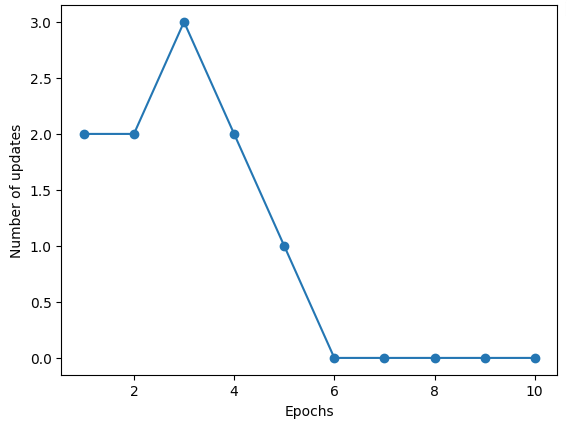
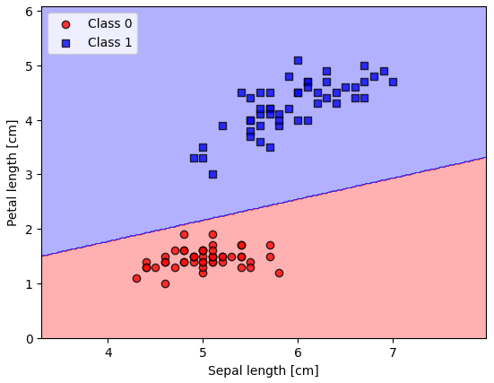
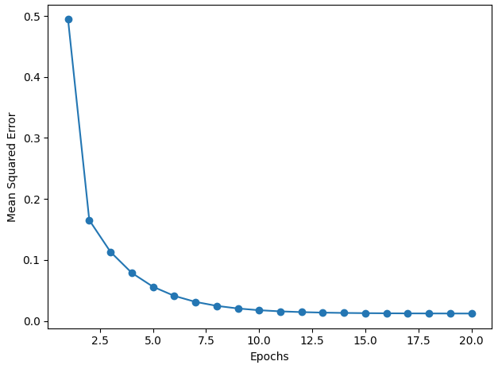
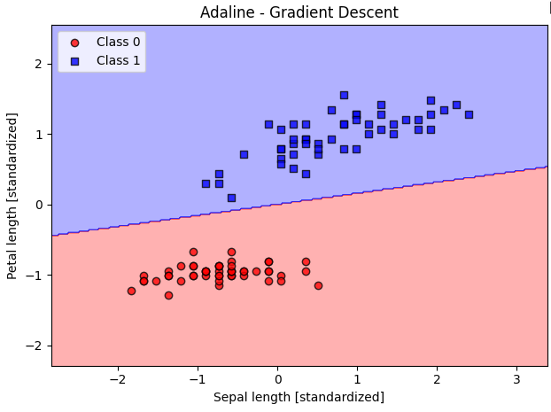
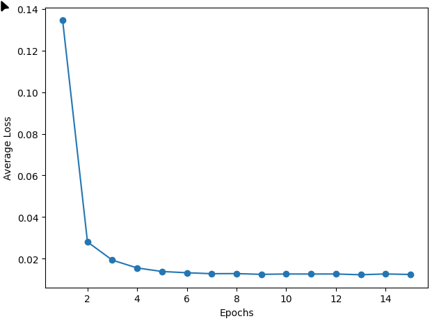
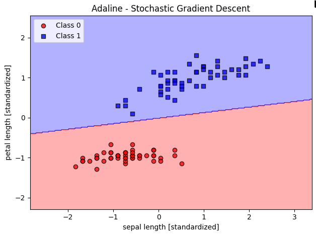

# 323 - Funktional Programmieren

## Projekt - Machine learning Algorithmen

[Projekt Ordner](./assignments/project/ml-classifiers/)

Für dieses Projekt werden binäre Machine Learning Klassifikatoren funktionell in **Scala** implementiert. Als Datensatz wird der [Iris Datensatz](https://archive.ics.uci.edu/ml/machine-learning-databases/iris/iris.data) verwendet.

---

## 1. Perceptron

[Perceptron](assignments/project/ml-classifiers/src/main/scala/classifiers/Perceptron.scala)

Der Perceptron-Algorithmus ist ein einfacher Lernalgorithmus, der auf der Funktionsweise biologischer Neuronen basiert. 

Es wird eine Entscheidungsfunktion definiert, σ(z), die eine lineare Kombination bestimmter Input-Werte, x, und eines Gewichtungsvektors, w, annimmt.

Ist der Netto-Input eines bestimmten Beispiels, $x^{(i)}$, grösser als ein vordefinierter Schwellwert, $\theta$, wird die Klasse 1 geschätzt, andernfalls Klasse 0.

_Abbildung 1.1: Falsch Vorhersagen je Iteration im Perceptron Algorithmus_

_Abbildung 1.2: Resultierende Entscheidungs Region durch den Perceptron Algorithmus_

---

## 2. Adaline

[AdalineGD](assignments/project/ml-classifiers/src/main/scala/classifiers/AdalineGD.scala)

Der **Adaline (ADaptive LInead NEuron)** basiert auf dem [Perceptron](#Perceptron) Algorithmus und illustriert Konzepte der Definition und kontinuierter Minimierung einer Verlust Funktion. 

_Abbildung 2.1: Kontinuierliche Minimierung der Fehler im Adaline Algorithmus_

_Abbildung 2.2: Resultierende Entscheidungs Region durch den Adaline Algorithmus_

---

## 3. AdalineSGD

[AdalineSGD](assignments/project/ml-classifiers/src/main/scala/classifiers/AdalineSGD.scala)

Beim **Stochastic Gradient Descent (SGD)** werden die Gewichte nicht erst am Ende einer Epoche für alle Datenpunkte auf einmal angepasst, sondern **nach jedem einzelnen Datenpunkt** (also _online_). Ausserdem werden die Daten vor jeder Epoche gemischt (`shuffle`), um Zyklen zu vermeiden.

_Abbildung 3.1: Fehler Verlauf im AdalineSGD Algorithmus_

_Abbildung 3.2: Resultierende Entscheidungs Region durch den AdalineSGD Algorithmus_

---

> **Quellen**:
> Sebastian Rascka und Vahid Mirjalili, Machine Learning with PyTorch and Scikit-Learn, 2019, Packt Publishing
> 
> **Ressourcen:**
> [Miro Board](https://miro.com/app/board/uXjVGCMHdFU=/)
> [Module Übersicht](https://docs.google.com/document/d/1nLG-KSTFBL7-Wcgilpr6mH3uZvVkrVVNwSujTTcfqzQ/edit?tab=t.0)
